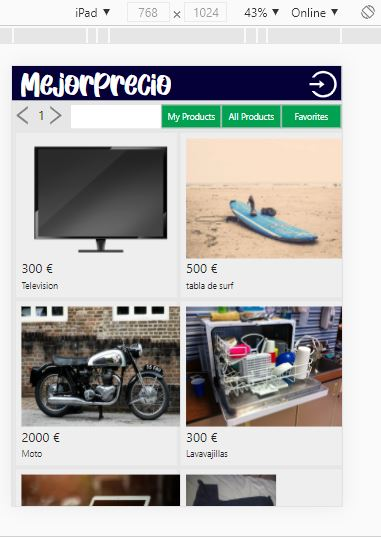
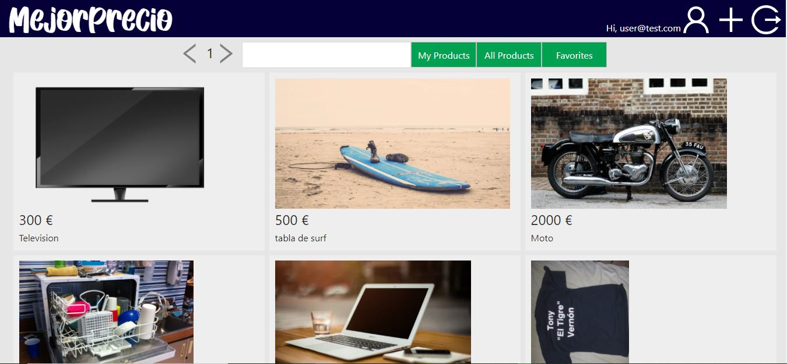
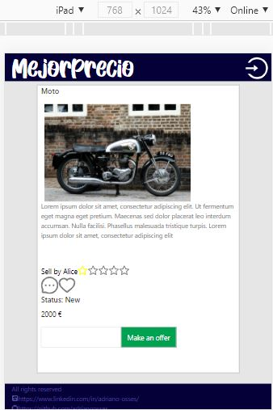

# FINAL FRONT
Backend part: https://github.com/adrianoosses/final-back
## TABLE OF CONTENTS
1. [ SET UP ](#set-up) :rocket:
2. [ DATABASE ](#db) :rocket:
3. [ RUN ](#run) :rocket:
4. [ TECHNOLOGIES USED ](#tech) :rocket:
5. [ AUTHOR ](#author) :rocket:

<a name="set-up"></a>
## SET UP
<a name="db"></a>
Option 1: Heroku
Option 2: Local
1. Clone the repository:
```
git clone <name-of-this-repo.git>
```
2. Change the back path into App.js:
```
export const CURRENT_URL = 'http://127.0.0.1:3001';
```
## DATA BASE

<a name="run"></a>
## RUN
Option 2:
Type:
```
npm start
```

1) Main view. Click on Log In button, on top-right corner.


View from iPad:


2) First click on Sign up. If you don't have account yet, click on Sign up.


3) Sign up an account following next example format


4) Then, you can appreciate new buttons on top


5) Click on some product to see details. Now you can add to favorites, make an offer to seller, score or send him a message.


View from iPad:


6) On main view, you can see products selected as favorites


7) You can upload your products to sell


and see your products to sell on main view


8) After, you can receive offers and see them on your product details


9) If you want to send a message, click on Chat button. If you want see last messages received, refresh the page.


10) An admin can listing every data users.


<a name="tech"></a>
## TECHNOLOGIES USED
- JavaScript
- HTML
- CSS
- NodeJS
- Express
- API REST
- JWT
- Axios
- React


<a name="author"></a>
## AUTHOR
Adriano Osses
